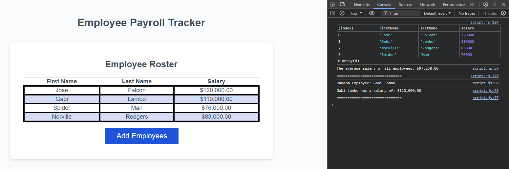

# employee-salary-data-manager

## Description

This project is an Employee Salary Manager built using HTML, CSS, and JavaScript. It allows users to add employee details (Full name and salary), calculate and display the average salary of all employees, then it select a random employee using the Math.floor and Math.random methods of Javascript. The system is designed to be user-friendly, prompting users for necessary inputs and displaying the information in a structured format.

## Features

- Add Employees: Users can input the number of employees and their details (first name, last name, salary).
- Display Average Salary: The system calculates and displays the average salary of all employees.
- Select Random Employee: A random employee is selected and their details are displayed.
- Display Employees: Employee details are displayed in a table format on the webpage and viewable in the Array element in the console.

## Mock-Up

## Learning Outcomes

- Understanding DOM manipulation using JavaScript.
- Implementing user input validation and calculation.
- Learning to create and utilize Javascript functions.
- Using JavaScript to dynamically create and update HTML elements.
- Formatting numbers as currency strings in JavaScript.

## Usage

1. Clone the repository.
2. Open index.html in your web browser.
3. Click the "Add Employees" button.
4. Follow the prompts to input Employee details.
5. The employee details will be displayed in a table on the webpage.
6. View the average salary and a randomly selected employee's details in the console.

## License

This project is licensed under the MIT License.
